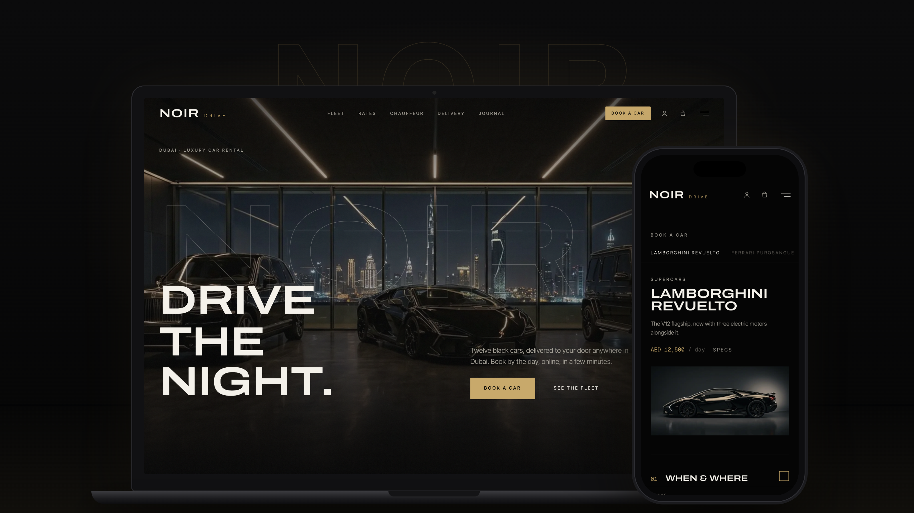
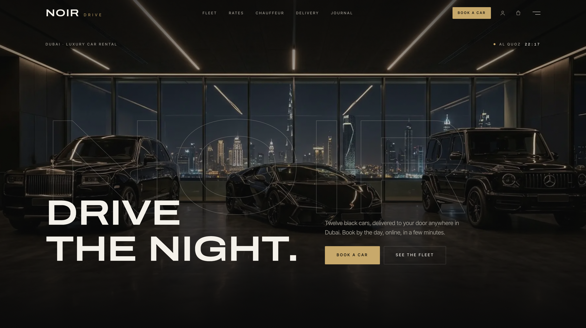
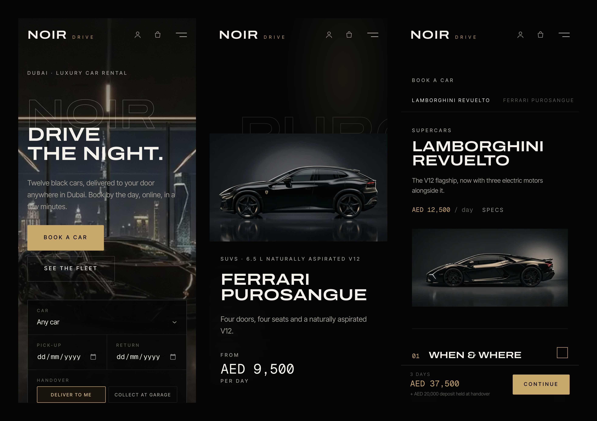
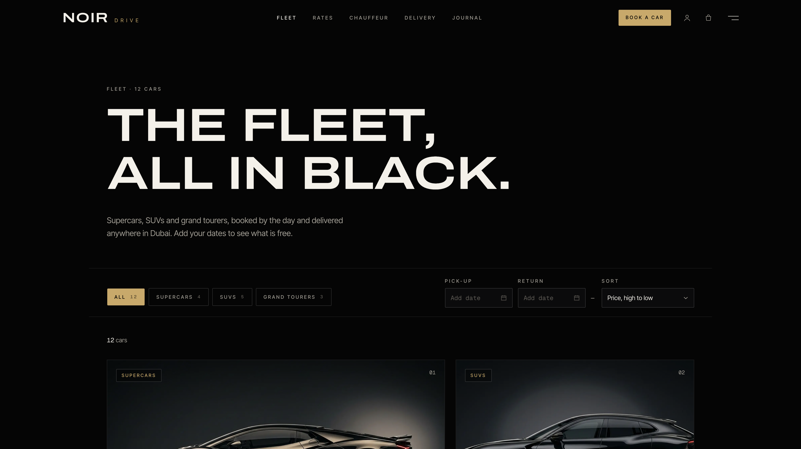
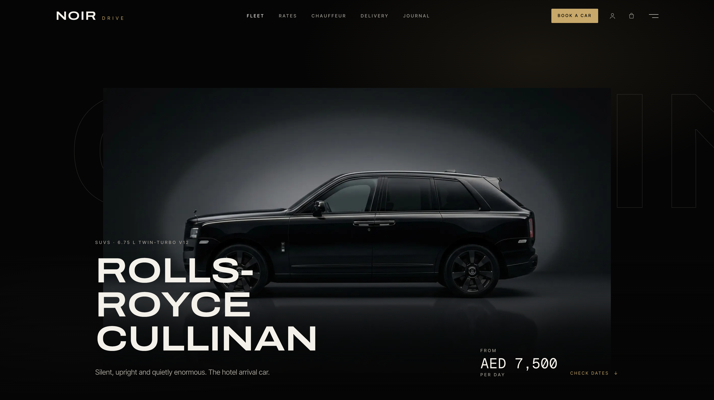
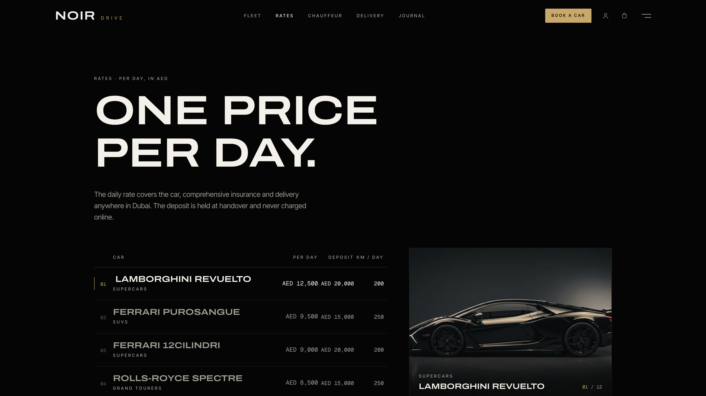
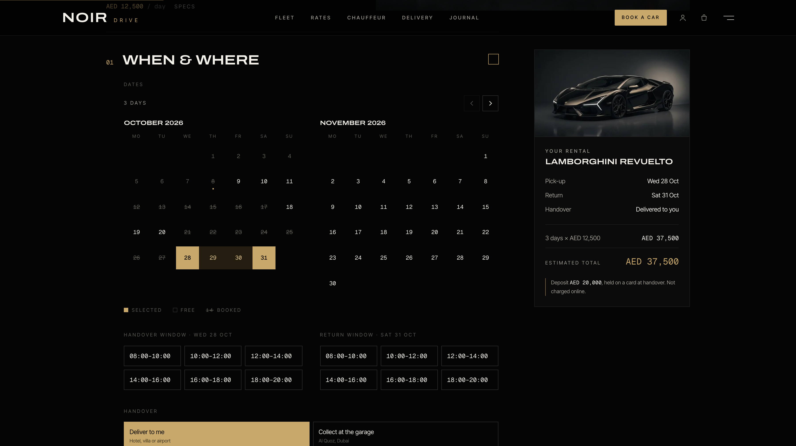
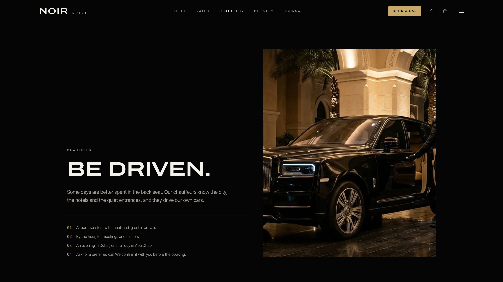

# NOIR Drive — Next.js Luxury Car Rental Template

A production-ready rental website for a premium car-hire business. Built with **Next.js 15**, **Tailwind CSS v4**, and the **Opencals Storefront SDK**.

**[View Live Demo →](https://template-noir.vercel.app)**



Black, cinematic and heavily animated: near-black surfaces, one champagne accent, an expanded automotive display face and monospaced specs. Set in **Dubai** (AED, `Asia/Dubai`) with an all-black fleet of twelve supercars, SUVs and grand tourers booked **by the day**, delivered to the customer's door, plus **chauffeur packages** with real drivers. Full storefront included — fleet, car pages, rates, multi-day booking, chauffeur flow, checkout, customer accounts — wired up out of the box. MIT licensed: clone it, rebrand it, ship it.

---

## Get Started in 3 Steps

### 1. Create an Opencals account

Sign up at **[app.opencals.com](https://app.opencals.com)** and create a **Dev Store**. When prompted for a dataset, choose the **NOIR Drive** preset (category **Car rental**, seed dataset `car_rental`). It seeds your store with the twelve cars on a continuous 24/7 schedule, the garage and delivery locations, per-day and fixed extras, the checkout questions (licence and ID uploads, date of birth, rental terms), four chauffeurs and their packages, so your template looks exactly like the demo.

### 2. Get your API key

Go to your **User Account Settings** in the Opencals dashboard and generate a **Storefront API key**. You'll need this to connect the template to your store.

### 3. Deploy to Vercel

[](https://vercel.com/new/clone?repository-url=https%3A%2F%2Fgithub.com%2Fletsopencals%2Ftemplate-noir&env=OPENCALS_API_KEY,AUTH_SECRET&envDescription=API%20key%20from%20your%20Opencals%20dashboard%20and%20a%20random%20secret%20for%20auth&project-name=noir-drive&repository-name=template-noir)

During deployment, Vercel will ask you to set environment variables:

| Variable | Value |
|----------|-------|
| `OPENCALS_API_KEY` | Your Storefront API key (starts with `sfk_`) |
| `AUTH_SECRET` | Any random string — used for session encryption |
| `NEXT_PUBLIC_STRIPE_PUBLISHABLE_KEY` | *(optional)* Stripe publishable key for payments |

Then set `url` in `lib/site-config.ts` to your domain (it drives the sitemap, canonical URLs and Open Graph). That's it.

---

## The Storefront





---

## What's Included

### The Fleet

- **`/fleet`** — category filters from your collections (Supercars, SUVs, Grand tourers), sort by price, and **"available for your dates"**, which filters the grid against live availability.
- **`/fleet/[slug]`** — a scroll-driven hero, a spec strip that counts up (power, 0–100, top speed, seats), a gallery, what's included (km per day, insurance, delivery), the deposit and driver requirements, a two-month **availability calendar** with booked days struck through, and a sticky booking card with a live estimate. `Product` + `Offer` structured data.
- **`/rates`** — the full rates table (daily rate, deposit, km per day) where the hovered row swaps the car image, plus chauffeur rates and a "before you book" grid.







### Multi-Day Booking

**`/book?car=<slug>&from=&until=`** is a single-page, sectional flow:

1. **When and where** — a range calendar backed by the car's live availability, handover and return time windows, and *Deliver to my address* or *Collect at the garage*.
2. **Extras** — per-day extras (excess waiver, additional driver) priced × days, and fixed extras (child seat, Abu Dhabi delivery, mileage pack, prepaid fuel).
3. **You** — customer details and the checkout questions, including driving licence and passport / Emirates ID uploads and the deposit-and-terms checkbox.
4. **Payment** — Stripe Elements, with cash and no-payment fallbacks.

A sticky estimate bar animates the total as the customer chooses. Price is always **days × daily rate + extras**, the same maths the engine charges.



### Chauffeur

**`/chauffeur`** lists the packages (airport transfer, by the hour, an evening in Dubai, a day in Abu Dhabi). Each books through the classic staff flow — when → driver → extras → details → pay — with a *preferred car* request.



### Customer Accounts

Passwordless sign-in by default: customers enter their email and receive a 6-digit login code (password sign-in stays available). The account area is **rental-aware**: a rental shows pick-up → return dates in Dubai time, the number of days, the handover and return windows, flight number, and the delivery address or garage; chauffeur bookings show the driver and preferred car. Customers can **change dates** (same number of days, checked against the car's availability) or cancel within the product's policy, and browse order history.

One-time email links from Opencals (view/reschedule/cancel booking, leave feedback, verify email, reset password) all resolve through the `/link/[token]` route, which signs the customer in and redirects them to the right place.

> **Set your Storefront Base URL.** For emailed links to point back to this app, set **Storefront Base URL** in your Opencals dashboard (Settings → API) to your deployed URL (e.g. `https://your-domain.com`). Opencals builds every customer link as `{storefrontBaseUrl}/link/{token}`.

### Marketing Pages

A cinematic home page (hero with a quick booking bar, fleet carousel, pinned car spotlight, delivery map, chauffeur teaser, details gallery, testimonials, FAQ), **How it works**, **Delivery** (zones, fees, airport meet-and-greet), a **Journal** of five UAE driving routes, **About** and **Contact**.

### Motion

Lenis smooth scrolling, line-mask text reveals, clip-path image reveals, parallax, count-up specs, a car "drive-in", a marquee, magnetic CTAs, page transitions and a scroll progress bar. Every effect has a `prefers-reduced-motion` fallback.

### SEO Ready

Per-page metadata, Open Graph cards, `AutoRental` and `Product` structured data, robots.txt, and sitemap.xml — configured out of the box.

---

## The Rental Model

NOIR Drive uses existing Opencals features only. If you build your own rental site, this is the pattern:

- **One car = one product with no staff.** Base `duration: 86400` (one day is the pricing unit), `allowCustomDuration: true`, a `maxDuration` (30 days in the seed) and `maxAttendees: 1`. Each car sits in its own product pool, so a booking blocks that car at both the garage and the delivery location (without a pool, staffless products count bookings per location). Each car is its own product, not a variant, because variants don't block each other.
- **A continuous schedule.** Every car is on a 24/7 schedule (every day 00:00–23:59:59), so availability runs across midnight and a booking can span many days. Bookings longer than 24 hours are validated against continuous availability on the server.
- **Ranges, not slots.** The UI reads the car's merged availability ranges (`Products.getCurrentAvailabilitiesMerged`, via `/api/products/[slug]/ranges`) **without** a duration, and decides on the client whether the chosen pick-up → return dates fit inside one range (`lib/rental.ts` → `fitsDates`, `latestReturnDate`). The server re-checks on booking.
- **00:00-local slots.** A booking runs from the pick-up date 00:00 to the return date 00:00 in the store timezone, converted to UTC (`toAppointmentSlot`). Dubai 10 → 13 Nov becomes `{ fromDate: '2026-11-09', fromTime: '20:00:00', toDate: '2026-11-12', toTime: '20:00:00' }` — three days, three units, three × the daily rate.
- **Custom attributes for the handover.** The handover window, return window, a different collection address and the flight number are **not** part of the slot. They travel as appointment `customAttributes` (keys in `siteConfig.customAttributeKeys`: `handover_time`, `return_time`, `collect_address`, `flight_number`, `preferred_car`) and show up in the dashboard and the customer's account.
- **Deposit at handover.** The security deposit is shown per car and accepted with a required checkout checkbox. It's held on a card at handover and never charged online.
- **Delivery location.** Each car is attached to two locations: a PHYSICAL garage (collect yourself) and a DELIVERY location, where the customer's address is captured at checkout through the standard delivery-address flow.
- **Per-day extras.** Add-ons with `durationMultiplied` are charged per booked unit, which is exactly per day because the base duration is one day.

---

## Tech Stack

| Category | Technology |
|----------|-----------|
| Framework | Next.js 15 (App Router) |
| Styling | Tailwind CSS v4 |
| Fonts | next/font: Archivo (expanded), Inter Tight, Geist Mono |
| Animations | Framer Motion + Lenis |
| Data | SWR (client) + React Server Components |
| Forms | react-hook-form + Zod |
| Payments | Stripe Elements |
| Auth | NextAuth.js v5 |
| Dates | moment-timezone |
| API | Opencals Storefront SDK (v0.3.14) |

---

## Local Development

```bash
git clone https://github.com/letsopencals/template-noir.git
cd template-noir
npm install
cp .env.example .env
```

Edit `.env` with your values:

```
OPENCALS_API_KEY=sfk_your_key_here
AUTH_SECRET=change_me_to_a_random_string
```

```bash
npm run dev
```

Open [http://localhost:3000](http://localhost:3000).

---

## Customization

### Branding & Content

All business-specific copy is centralized in **`lib/site-config.ts`**:

- Name, tagline, wordmark, site URL, currency and timezone
- Fleet categories and `fleetContent[slug]` — per-car tagline, specs, deposit, km per day, minimum age and gallery (cars that aren't listed fall back to the API data)
- Handover time windows, delivery zones, requirements, FAQs, testimonials
- Journal routes, chauffeur copy, about and contact details, footer and social links

The bookable data (cars, prices, availability, extras, chauffeurs) comes from your Opencals store.

### Theme Colors

Design tokens live in **`app/globals.css`** as Tailwind v4 `@theme` properties. Token names are stable across the Opencals templates, so components keep working when you change the values:

```css
@theme {
  --color-bg: #050505;          /* page black */
  --color-surface: #0B0B0C;     /* panels */
  --color-ink: #F4F1EA;         /* warm ivory text */
  --color-primary: #C8A96B;     /* champagne accent */
  --color-line: rgba(255, 255, 255, 0.08);
}
```

Every `rounded-*` utility collapses to 2px for the squared, automotive look.

### Imagery

Every image sits in an `.image-placeholder` container and renders through `SafeImage`, so a missing file falls back to a dark, lit gradient instead of a broken box. **Car and chauffeur photos, the home hero cover and the logo come from your Opencals store**: product images (the default one first, the rest form the car gallery), staff photos, and the storefront banner and logo. Change them in the dashboard, not in the code. Only editorial art ships in `public/images/{lifestyle,routes,chauffeur}/`, plus an optional `public/videos/hero.mp4`. See **`public/images/PLACEHOLDERS.md`**.

---

## Project Structure

```
app/
  page.tsx                     # Home
  fleet/                       # Fleet grid + car pages
  rates/                       # Rates table
  book/                        # Multi-day rental booking
  chauffeur/                   # Chauffeur packages
  booking/[slug]/              # Classic staff flow (chauffeur)
  thank-you/                   # Confirmation
  how-it-works/ delivery/ journal/ about/ contact/
  account/                     # Customer dashboard (rental-aware)
  auth/                        # Sign in, sign up, password reset
  link/[token]/                # One-time email link resolver
  api/                         # API routes proxy SDK calls server-side

components/
  layout/                      # Header, menu overlay, footer, wordmark
  motion/                      # Reveal, parallax, count-up, drive-in, page transitions
  booking/ rental/             # Booking steps, range calendar, extras, checkout
  account/                     # Account pages, appointment and order detail
  ui/                          # Shared primitives (button, input, safe-image, ...)

hooks/                         # use-car-ranges, use-rental-booking, use-booking-flow, ...
lib/                           # site-config, rental (fit + slot maths), server-data, opencals, auth
```

## Environment Variables

| Variable | Required | Description |
|----------|----------|-------------|
| `OPENCALS_API_KEY` | Yes | Storefront API key from your Opencals dashboard |
| `AUTH_SECRET` | Yes | Random string for NextAuth session encryption |
| `NEXT_PUBLIC_STRIPE_PUBLISHABLE_KEY` | No | Stripe publishable key for payment processing |
| `OPENCALS_API_URL` | No | Override API base URL (defaults to production) |

The public site URL is `url` in `lib/site-config.ts`.

---

## Other Templates

NOIR Drive is one of the open-source booking templates built on the Opencals Storefront SDK. Same backend, different design and vertical:

- **[Clear Care](https://github.com/letsopencals/template-clarity)** — a medical clinic template with department-first booking. [Live demo](https://template-clarity.vercel.app)
- **[Frisor](https://github.com/letsopencals/template-frisor)** — a modern barbershop template with a dark editorial palette. [Live demo](https://template-frisor-sage.vercel.app)
- **[HAAR](https://github.com/letsopencals/template-haar)** — a hair-salon booking template with a light, warm palette. [Live demo](https://template-haar.vercel.app)
- **[VOLT](https://github.com/letsopencals/template-volt)** — a padel & squash club template with a court booking grid. [Live demo](https://template-volt.vercel.app)

See all templates and the Storefront API at **[opencals.com/developers](https://opencals.com/developers)**.

## Build with AI

Prefer to let an AI agent do the heavy lifting? Install the **[Opencals Agent Skills](https://github.com/letsopencals/skills)** in Claude Code, Cursor, Codex or Gemini CLI:

- **`opencals-build-booking-site`** — scaffold, wire and deploy a template like this one (see `references/rentals-multi-day.md` for the rental pattern)
- **`opencals-storefront-api`** — ground-truth reference for the Opencals API & SDK

Docs: **[opencals.com/docs → AI Agents](https://opencals.com/docs/ai-agents/overview)**.

## License

MIT
